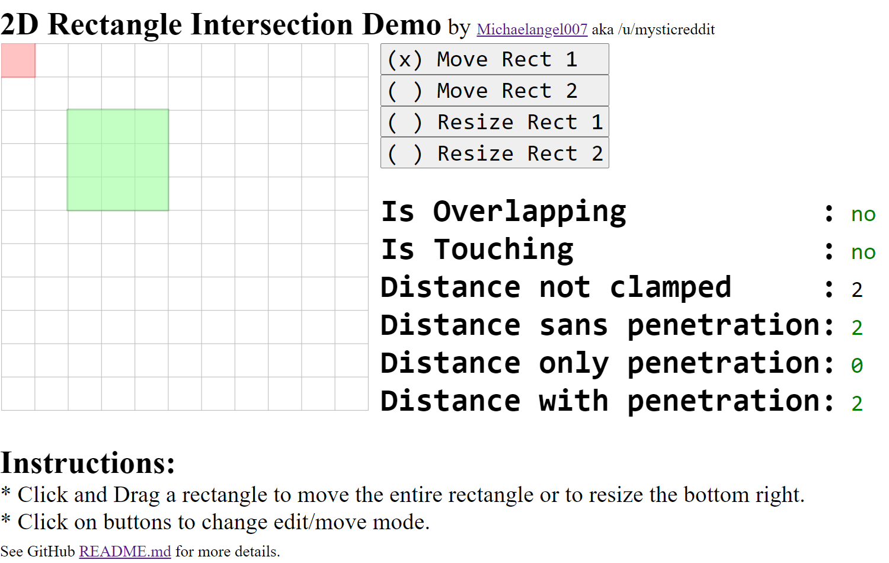

# 2D Rectangle Intersection

# Demo

* 

Click Here --> [Demo](https://htmlpreview.github.io/?https://github.com/Michaelangel007/rect2d_intersection/blob/master/index.html) <-- Click Here

# Introduction

Given two 2D AABB (Axis Aligned Bounding Boxes) rectangles how do we tell:

* If they are overlapping?
* If they are touching?
* The distance separating them?
* The distance the first is penetrating into the second?

First, we need to define a (integer) rectangle:

```c
struct Rect2d
{
    int top, left;
    int bot, right;
}
```

Second, we'll assume two things about our rectangles:

* left <= right
* top <= bot

Third, our contact surface can be either:

* a point
* a line, or
* a polygon

We won't worry about the _type_ of contact surface only simple distances.


# 1D

Let's look at the simpler 1D case first of 2 lines (with non-zero thickness).  Consider this example:

* rectangle 1, `---`, is 3 cells wide, and
* rectangle 2, `||||`, is 4 cells wide.

We'll examine the states as rectangle 1 (dynamic) moves right over time and rectangle 2 is stationary (static) at Left=4, Right=8. We'll designate where they overlap with `+`:

For clarity we'll also zoom in 2x.

```
                          1 1 1
Case  0 1 2 3 4 5 6 7 8 9 0 1 2   Rect1             Distance and notes
A)    ------  ||||||||            Left=0, Right= 3  +1  Closest to left edge
B)      ------||||||||            Left=1, Right= 4   0  Closest to left edge
C)        ----++||||||            Left=2, Right= 5  -1  Closest to left edge
D)          --++++||||            Left=3, Right= 6  -2  Closest to left edge
E)            ++++++||            Left=4, Right= 7  -3  Closest to left edge
F)            ||++++++            Left=5, Right= 8  -3  Closest to right edge
G)            ||||++++--          Left=6, Right= 9  -2  Closest to right edge
H)            ||||||++----        Left=7, Right=10  -1  Closest to right edge
I)            ||||||||------      Left=8, Right=11   0  Closest to right edge
J)            ||||||||  ------    Left=9, Right=12  +1  Closest to right edge
      0 1 2 3 4 5 6 7 8 9 1 1 1   Rect1             Distance and notes
                          0 1 2
```

Betwen two rectangles the distance is:

* `>  0` if separated,
* `== 0` if touching, or
* `<  0` if penetating.
  
From this we can see there are 2 trivial edge cases when separated:

* 1's Right edge <= 2's Left Edge // Cases A and B
* 1's Left edge >= 2's Right edge // Cases H and I

That is:


```c
bool is_overlapping( const Rect2d &rect1, const Rect2d &rect2 )
{
    if (rect1.right <= rect2.left ) return false; // NOT_OVERLAPPING;
    if (rect1.left  >= rect2.right) return false; // NOT_OVERLAPPING
}
```

For symmetry we can reverse that second test.  From algebra we know we can flip the comparision if we _also_ swap the left and right sides.  i.e. These two lines are equivalent for determing the mininum value:

```c
   if (a <  b) return a;
   if (b >  a) return a;
```   

Thus our second equation becomes:

```c
bool is_overlapping( const Rect2d &rect1, const Rect2d &rect2 )
{
    if (rect1.right <= rect2.left) return false; // NOT_OVERLAPPING
    if (rect2.right <= rect1.left) return false; // NOT_OVERLAPPING
}
```

# 2D

We can trivial reject if the two rectangles are overlapping in the X axis or Y axis via:

```c
bool is_overlapping( const Rect2d &rect1, const Rect2d &rect2 )
{
    // Trivial reject
    if (rect1.right <= rect2.left) return false; // NOT_OVERLAPPING
    if (rect2.right <= rect1.left) return false; // NOT_OVERLAPPING
    if (rect1.bot   <= rect2.top ) return false; // NOT_OVERLAPPING
    if (rect2.bot   <= rect1.top ) return false; // NOT_OVERLAPPING

    return true;
}
```

# Overlapping

How do we determine if two rectangles are overlapping for the remaining case?

Using our 1D example again let's examine the two distances between the left/right edges. Specifically, from our trivial cases we looked at:

* Rect1  is left of Rect2 -> Rect 1 Right Edge, `R1`, and Rect 2 Left Edge, `L2`, and
* Rect1 is right of Rect2 -> Rect 1 Left Edge, `L1` and Rect 2 Right Edge, `R2`.

Let's inspect those values: (Recall that Rectangle 2 is static with L2=4 and R2=8).

```
                          1 1 1
Case  0 1 2 3 4 5 6 7 8 9 0 1 2   Rect1               Dist    L2-R1     L1-R2   max(L2-R1,L1-R2)
A)    ------  ||||||||            Left=0, Right= 3    +1      4- 3=+1   0-8=-8  +1
B)      ------||||||||            Left=1, Right= 4     0      4- 4=+0   1-8=-7   0
C)        ----++||||||            Left=2, Right= 5    -1      4- 5=-1   2-8=-6  -1
D)          --++++||||            Left=3, Right= 6    -2      4- 6=-2   3-8=-5  -2
E)            ++++++||            Left=4, Right= 7    -3      4- 7=-3   4-8=-4  -3
F)            ||++++++            Left=5, Right= 8    -3      4- 8=-4   5-8=-3  -3
G)            ||||++++--          Left=6, Right= 9    -2      4- 9=-5   6-8=-2  -2
H)            ||||||++----        Left=7, Right=10    -1      4-10=-6   7-8=-1  -1
I)            ||||||||------      Left=8, Right=11     0      4-11=-7   8-8=-0   0
J)            ||||||||  ------    Left=9, Right=12    +1      4-12=-8   9-8=+1  +1
      0 1 2 3 4 5 6 7 8 9 1 1 1   Rect1               Dist           
                          0 1 2
```

We can generate that L2-R1 and L1-R2 table via this JavaScript code:
```js
   var L1=0, R1=3, L2=4,R2=8, text = "\n";
   for( ; L1 <= 9; ++L1, ++R1 )
        text += L2 +" - "+ R1 +" = "+ (L2 - R1) +"    "
             +  L1 +" - "+ R2 +" = "+ (L1 - R2) +"    "
             + Math.max((L2 - R1),(L1 - R2))    +"\n";
   console.log( text );
```

The distance detween the **two closest edges** is `max((L2-R1),(L1-R2))` and thus we end up with this for the x-axis:

```c
    int x1 = r2.left - r1.right; // L2 - R1
    int x2 = r1.left - r2.right; // L1 - R2
    int dx = MAX( x1, x2 );
```

Doing the same for the y-axis:

```c
    int y1 = r2.top - r1.bot;
    int y2 = r1.top - r2.bot;
    int dy = MAX( y1, y2 );
```

With `dx` and `dy` we can use the [Pythagorean theorem](https://en.wikipedia.org/wiki/Pythagorean_theorem) we can calculate the distance or hypotenuse length: (This is also the radius of a circle):

```c
    int r = dx*dx + dy*dy;
    int d = sqrt( r );
```

Since we are on an integer Cartesian grid we need to clamp to integers via **rounding up:**

```c
    int r = dx*dx + dy*dy;
    int d = ceil( sqrt( r ) );
```

Now since `r` will always be positive we _don't actually need to calculate the square root!_  All we care about is if _the sign of r is positive!_

```c
    int r = dx*dx + dy*dy;
    return (r > 0);
```

We end up:

```c
bool is_overlapping( const Rect2d &rect1, const Rect2d &rect2 )
{
    // Trivial reject
    if (rect1.right <= rect2.left) return false;
    if (rect2.right <= rect1.left) return false;
    if (rect1.bot   <= rect2.top ) return false;
    if (rect2.bot   <= rect1.top ) return false;

    int x1 = r2.left - r1.right; // L2 - R1
    int x2 = r1.left - r2.right; // L1 - R2
    int dx = MAX( x1, x2 );

    int y1 = r2.top - r1.bot;
    int y2 = r1.top - r2.bot;
    int dy = MAX( y1, y2 );

    int r = dx*dx + dy*dy;
    return (r > 0);
}
```

# Separated

If we clone `is_overlapping()` to a new function `distance_separated()` and restore the square root we optimized out ...

```c
int distance_separated( const Rect2d &rect1, const Rect2d &rect2 )
{
    // Trivial reject
    if (rect1.right <= rect2.left) return false;
    if (rect2.right <= rect1.left) return false;
    if (rect1.bot   <= rect2.top ) return false;
    if (rect2.bot   <= rect1.top ) return false;

    int x1 = r2.left - r1.right; // L2 - R1
    int x2 = r1.left - r2.right; // L1 - R2
    int dx = MAX( x1, x2 );

    int y1 = r2.top - r1.bot;
    int y2 = r1.top - r2.bot;
    int dy = MAX( y1, y2 );

    int r = dx*dx + dy*dy;
    int d = ceil( sqrt( r ) );

    return d;
}
```

... we immediately notice two problems:

1) We need to change `return false` to a distance if the two rectangles are separated, and
2) When the rectangles are overlapping _we have a positive distance_ instead of zero.

The first is trivial to solve.  Just remove the trivial reject.

The second we need to understand HOW or WHY this is happening.

Recall that `r` is ALWAYS >= 0 due to `dx*dx` and/or `dy*dy.

We are not handling the edge case when `dx` or `dy` is negative thus we need to clamp those to zero:

```c
int distance_separated( const Rect2d &rect1, const Rect2d &rect2 )
{
    int x1 = r2.left - r1.right; // L2 - R1
    int x2 = r1.left - r2.right; // L1 - R2
    int dx = MAX( x1, x2 );

    int y1 = r2.top - r1.bot;
    int y2 = r1.top - r2.bot;
    int dy = MAX( y1, y2 );

    if (dx < 0) dx = 0;
    if (dy < 0) dy = 0;

    int r = dx*dx + dy*dy;
    int d = ceil( sqrt( r ) );

    return d;
}
```

# Penetrating

If rectangle 1 overlaps rectangle 2 how do we calculate the penetration distance? We need to calculate three things:

* test for `overlapping`
* get the *maximum* penetration depth, and
* return the separated distance

## Penetration Overlapping

What if we combined our `is_overlapping()` and `distance_separated()` into a third `distance_penetration()` somehow?

Let's first handle the case the two rectangles are overlapping:

```c
int distance_penetration( const Rect2d &rect1, const Rect2d &rect2 )
{
    int x1 = r2.left - r1.right; // L2 - R1
    int x2 = r1.left - r2.right; // L1 - R2
    int dx = MAX( x1, x2 );

    int y1 = r2.top - r1.bot;
    int y2 = r1.top - r2.bot;
    int dy = MAX( y1, y2 );

    bool overlapping = (dx*dx + dy*dy) > 0;

    if (rect1.right <= rect2.left) overlapping = false;
    if (rect2.right <= rect1.left) overlapping = false;
    if (rect1.bot   <= rect2.top ) overlapping = false;
    if (rect2.bot   <= rect1.top ) overlapping = false;
}

```

* [x] test for `overlapping`

### Penetration Maximum Distance

If we look at the _minimum_ between dx and dy that will tell us the maximum penetration depth:

```c
    int depth = MIN( dx, dy );      // maximum penetrating depth
```

## Penetration Separation Distance

We now need to clamp `dx` and `dy` to tell us the separated distance:

```c
    if (dx < 0) dx = 0;
    if (dy < 0) dy = 0;

    int r = dx*dx + dy*dy;          // clamped radius
    int d = ceil( sqrt(r) );        // seperated distance
}
```

Finally we can check the flags to tell which state we are in and return the correct distance:

```c
    if (d > 0)       return d;      // seperated
    if (overlapping) return depth;  // penetrating
    return 0;                       // touching
```

Putting it all together:

```c
int distance_penetration( const Rect2d &rect1, const Rect2d &rect2 )
{
    int x1 = r2.left - r1.right; // L2 - R1
    int x2 = r1.left - r2.right; // L1 - R2
    int dx = MAX( x1, x2 );

    int y1 = r2.top - r1.bot;
    int y2 = r1.top - r2.bot;
    int dy = MAX( y1, y2 );

    bool overlapping = (dx*dx + dy*dy) > 0;

    if (rect1.right <= rect2.left) overlapping = false;
    if (rect2.right <= rect1.left) overlapping = false;
    if (rect1.bot   <= rect2.top ) overlapping = false;
    if (rect2.bot   <= rect1.top ) overlapping = false;

    int depth = MIN( dx, dy );      // maximum penetrating depth

    if (dx < 0) dx = 0;
    if (dy < 0) dy = 0;

    int r = dx*dx + dy*dy;          // clamped radius
    int d = ceil( sqrt(r) );        // seperated distance

    if (d > 0)       return d;      // seperated
    if (overlapping) return depth;  // penetrating
    return 0;                       // touching
}
```

# Further Reading

The _Separation Axis Theorem_ is the generalization of two convex sets.

* [SAT](https://en.wikipedia.org/wiki/Hyperplane_separation_theorem)


Last updated: Tuesday, Nov. 1, 2022.
